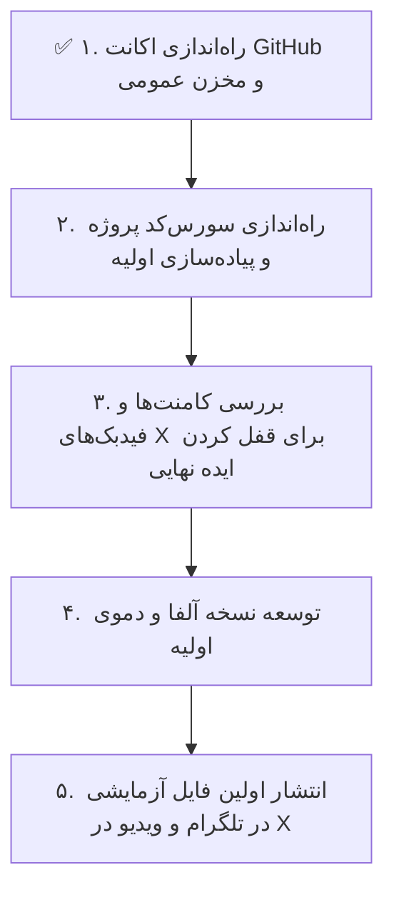

# 📘 مستندات، پیشینه و مانیفست پروژه (Project History & Manifesto)

**پروژه:** چالش ۳۰ روزه ساخت محصول مستقل (30-Day App Challenge)  
**نام برند/سازنده:** Mr. Builder  
**تاریخ آغاز:** ۲۶ سپتامبر ۲۰۲۶ (۵ مهر ۱۴۰۵)  
**وضعیت:** فاز صفر — تکمیل زیرساخت شبکه‌های اجتماعی، هویت بصری و آماده‌سازی مخزن کد  

---

## ۱. هدف و فلسفه پروژه (Mission & Vision)

### چرا این پروژه را شروع کردیم؟
بیشتر برنامه‌نویس‌ها ماه‌ها در اتاق‌های دربسته و بدون تعامل با دنیای واقعی کد می‌زنند و در نهایت محصولی می‌سازند که یا به دلیل قطعی اینترنت کار نمی‌کند یا کاربری برای آن وجود ندارد.  
هدف این پروژه شکستن این چرخه با رویکرد **Build in Public (ساخت در ملأ عام)** است:
1. **جامعه هدف مشخص:** کاربران و برنامه‌نویسان داخل ایران.
2. **معماری مستقل و آفلاین (Offline-First / Local-First):** محصول نباید به APIهای خارجی یا سرورهای ابری حساس وابسته باشد تا در صورت قطع اینترنت بین‌الملل یا اختلالات شبکه، ۱۰۰٪ کارایی خود را حفظ کند.
3. **همراهی مخاطب از روز صفر:** ایده، دیزاین و فازهای تست با همراهی مستقیم جامعه مخاطبان شکل می‌گیرد.

---

## ۲. هویت برند و زبان بصری (Brand & Visual Identity)

* **نام مستعار/هویت:** Mr. Builder
* **لحن کلام (Tone of Voice):**
  * کاملاً خاکی، صمیمی، شفاف و دوستانه.
  * **بدون واژه‌ها و قالب‌های کلیشه‌ای هوش مصنوعی (Anti-AI Clichés):** دوری از شعارهای تبلیغاتی پرطمطراق، ادعاهای اغراق‌آمیز و متون اتوکشیده.
* **سبک بصری (Visual Aesthetic):**
  * عکاسی آنالوگ و سبک فیلم ۳۵ میلی‌متری کاندید با نور گرم چراغ مطالعه در یک اتاق و میز کار واقعی.
  * چهره برنامه‌نویس با یک موشن بلور (Motion Blur) ملایم و استتیک برای ناشناس ماندن در عین حس زنده‌بودن و اصالت.
  * بنر هماهنگ شامل دفترچه یادداشت معماری سیستم، لپ‌تاپ و ادیتور کد واقعی.

---

## ۳. تاریخچه اقدامات انجام‌شده (Action Log)

### الف) پلتفرم X (توییتر سابق) — پایگاه کشف و تعامل
* **اکانت:** راه‌اندازی اکانت با تگ حرفه‌ای `Science & Technology` و نوع `Creator`.
* **تصاویر:** ست کردن پروفایل عکاسی کاندید و بنر اختصاصی میز کار.
* **بایو:** 
  > برنامه‌نویس و سازنده محصول 🛠️  
  > در حال ساخت یه اپ کاربردی از صفر (#BuildInPublic)  
  > لاگ روزانه و نسخه آزمایشی در تلگرام 👇
* **توییت افتتاحیه (پین‌شده):**
  > تصمیم گرفتم تو ۳۰ روز آینده یه اپ کاربردی بسازم و روندش رو اینجا بذارم 🛠️  
  > تو کار روزمره با گوشی یا لپ‌تاپ، چه کاری اعصابتون رو خرد می‌کنه که دوست داشتید یه ابزار ساده براش بود؟  
  > نظرتون رو بگید، با باحال‌ترین ایده شروع می‌کنیم 👇
* **ریپلای متصل‌کننده به تلگرام:** ثبت لینک کانال برای هدایت مخاطبان به کامیونیتی خصوصی.

---

### ب) کانال تلگرام (@MrbuildersAI) — پایگاه کامیونیتی و تسترهای بتا
* **آدرس کانال:** [https://t.me/MrbuildersAI](https://t.me/MrbuildersAI)
* **نام و توضیحات:** `لاگ ساخت اپ | Dev Log`
* **قابلیت‌های فعال‌شده:**
  * گروه بحث و گفت‌وگو (Discussion) برای فعال شدن دکمه `Leave a Comment` زیر تمام پست‌ها.
  * فعال‌سازی ری‌اکشن‌ها (🔥، 🚀، ❤️، 👍).
* **اولین پست پین‌شده (با لحن صمیمی و انسانی):**
  > سلام بچه‌ها 👋  
  > این کانال رو زدم که دور هم باشیم و روند ساخت اپ جدیدم رو باهاتون به اشتراک بذارم.  
  > از طرح‌های اولیه و اسکرین‌شات‌ها گرفته تا باگ‌ها و فایل‌های تستی رو می‌ذارم اینجا تا با هم چکش بزنیم.  
  > خیلی خوشحال می‌شم نظرات یا ایده‌هاتون رو تو کامنت‌ها بنویسید، دم همه‌تون گرم ❤️

---

### ج) پلتفرم LinkedIn (وضعیت: متوقف‌شده)
* به دلیل سیاست‌های سخت‌گیرانه احراز هویت پلتفرم لینکدین (Identity Verification / Persona) که برای کاربران داخل ایران محدودیت ایجاد می‌کند، تمرکز پروژه ۱۰۰٪ روی **مثلث طلایی سازندگان: توییتر (X) + تلگرام + گیت‌هاب** قرار گرفت.

---

## ۴. برنامه پیش‌رو (Next Milestones)

1. **گام اول (انجام شد ✅):** راه‌اندازی اکانت GitHub (`mrbuilder-dev`)، مخزن عمومی (`30day-app-challenge`) و ثبت اولین کامیت رسمی.
2. **گام دوم (انجام شد ✅):** توسعه کامل وب‌اپلیکیشن LocalBeam با پروتکل WebRTC DataChannel (انتقال آفلاین فایل در شبکه محلی بدون اینترنت).
3. **گام سوم (انجام شد ✅):** بازطراحی UI/UX بر اساس نسخه Stitch Option B (دراپ‌زون یکپارچه فایل به سبک WeTransfer + کارت هوشمند QR Code و رادار دستگاه‌های متصل، کاهش اصطکاک کاربر و لندینگ پیج ۳ گامه تعاملی).
4. **گام چهارم (انجام شد ✅):** تست با Headless Chrome و دیپلوی موفق روی GitHub Pages.
5. **گام بعدی:** توسعه روز دوم چالش ۳۰ روزه ساخت محصول.

